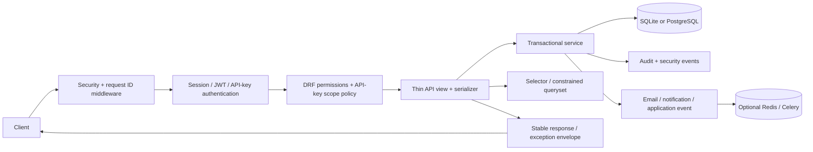
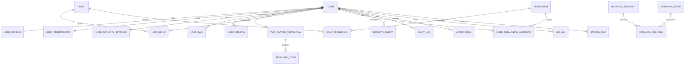

# Architecture

## Goals

This repository is application infrastructure, not a domain framework. Domain modules depend on stable identity, authorization, audit, task, notification, and storage interfaces. Infrastructure never imports project-specific apps. Critical state changes are explicit services wrapped in transactions; signals are deliberately absent from critical flows.

## Boundaries

| Package | Responsibility | Dependency direction | Classification |
| --- | --- | --- | --- |
| `config` | Environment settings, root URLs, ASGI/WSGI, optional Celery composition | Composes everything | Required |
| `common` | Dependency-light models, middleware, errors, responses, crypto, events, email, permissions | May depend on stable infrastructure models only where documented | Required |
| `accounts` | User identity, profile/preferences/security settings, states, bans | Django auth, audit/session services | Required |
| `authentication` | Credentials, one-time tokens, login, sessions, JWT state, TOTP/recovery | Accounts, security, audit, email | Required |
| `authorization` | Permission registry, roles, assignments, overrides, resolution | Accounts | Required |
| `security` | Security history and database/optional-Redis login protection | Accounts lazily in services | Required |
| `audit` | Immutable-from-application structured action history | Accounts FK only | Recommended core |
| `api` | `/api/v1` HTTP adapters; serializers and thin views | Calls services/selectors | Required for DRF projects |
| `core` | Typed runtime settings, flags, idempotency, health, common tasks/commands | Stable apps only | Required |
| `notifications` | In-app records and channel service | Accounts, centralized email | Optional |
| `api_keys` | Hashed keys, scopes, DRF authentication | Accounts, security, audit | Optional |
| `files` | Storage metadata, validation, cleanup hooks | Accounts, Django storage | Optional |
| `webhooks` | Signed outgoing endpoints/events/deliveries | Accounts, crypto, Celery/httpx | Optional |

An optional app is installed and migrated in the default distribution so a clone has a deterministic schema. Runtime flags omit/fail closed at public boundaries. Physical removal is a deliberate migration/dependency operation described in `CUSTOMIZATION.md`.

## Request flow



`RequestIDMiddleware` validates or creates `X-Request-ID` before application code. Authentication verifies account availability on every credential path. API keys are denied unless the target view explicitly declares scopes. Object access is constrained in `get_queryset()` and optionally checked through `IsOwnerOrHasPermission`; global authorization never substitutes for ownership filtering.

## Service and selector conventions

- A serializer validates transport shape. It does not coordinate side effects.
- A view selects a service, passes authenticated context, and returns a response.
- A service owns state transitions, validation that must also hold outside HTTP, row locking, audit/security records, and `transaction.on_commit()` side effects.
- A selector owns reusable read queries and applies `select_related`, `prefetch_related`, annotations, and ownership constraints.
- A task accepts JSON-serializable identifiers/data, re-reads current state, is retry-safe where possible, and never trusts caller authorization.

Existing simple reads live directly in constrained view querysets. Extract a `selectors.py` when a query gains reuse or complexity; do not create one-file wrappers for every `.get()`.

## Transaction and concurrency points

| Operation | Control |
| --- | --- |
| One-time token use | Hash lookup plus `select_for_update`; used marker and state transition share an outer transaction |
| Session/API-key/2FA revocation | Row lock and idempotent timestamp |
| Password/email/account changes | User row lock, token/session revocation, side effects on commit |
| Ban/revoke | User/ban row lock; access paths independently check active bans to tolerate scheduler lag |
| Recovery code use | Credential-scoped keyed hash plus row lock and one-time `used_at` |
| Idempotent API call | User/key unique constraint, request fingerprint, row lock, serialized completed response |
| Webhook delivery | Brief row-lock reservation into `PROCESSING`; network I/O occurs after commit; stale reservations recover |

SQLite is a supported lightweight database, but it cannot model all PostgreSQL concurrency characteristics. Run database-sensitive integration tests against PostgreSQL before deploying the recommended production database.

## Authentication architecture

Django sessions and JWTs share the custom user and account gate. Password login establishes a Django session for browser clients and returns short-lived access/rotating refresh tokens for external clients. Refresh tokens are stored by SimpleJWT’s outstanding/blacklist tables; rotation blacklists previous values. Security changes blacklist all outstanding refresh tokens. JWT authentication re-checks current account state and active bans; a previously issued access token therefore cannot bypass a ban.

One-time verification/reset/change/delete tokens are random values shown only in email. Only keyed hashes are stored. TOTP secrets and the server-required session reference use purpose-separated Fernet keys derived from installation material. API keys and recovery codes use purpose-separated keyed hashes.

Passkeys/WebAuthn fit beside `TwoFactorCredential`: introduce a credential interface and another verifier without changing registration, JWT, session, or RBAC services.

## Authorization architecture

Permissions are the contract; roles are collections. `register_permissions()` creates an in-process registry that `bootstrap` synchronizes additively. Resolution checks account eligibility, explicit deny, explicit allow, superuser, then active role assignments. The service performs fresh queries for sensitive state rather than caching permission answers across revocations.

For object authorization, constrain the base queryset first:

```python
def get_queryset(self):
    return Document.objects.filter(owner=self.request.user)
```

If a global permission may widen access, use an explicit selector and `IsOwnerOrHasPermission`. Do not fetch by raw UUID and check only in presentation code.

## Audit and events

Audit rows are structured and application-immutable: instance and queryset update/delete paths raise. Only `hard_delete_for_retention()` is exposed to the configured cleanup task, and retention defaults off. A database role that can write application tables can still tamper; high-assurance deployments should grant insert-only rights or stream to WORM/SIEM storage.

`EventBus` is a small synchronous in-process extension hook. Services publish after commit. Handlers are for decoupled non-critical side effects; critical integrity logic stays explicit in the transaction. If durable cross-service events become necessary, add an outbox model and dispatcher rather than treating this bus as durable messaging.

## Background work

Call `EmailService.enqueue` or a domain service, not Celery tasks from arbitrary views. Tasks live within the app owning their data. With Celery disabled, the task adapter executes dispatch synchronously; with it enabled, messages contain serializable primitives, not ORM objects or secrets. Beat retention is configurable and destructive policies default to conservative values.

## Infrastructure modes

- Minimal: SQLite, local Django cache, database-backed login throttling, synchronous task dispatch.
- Standard: PostgreSQL with the same no-Redis/no-worker behavior.
- Advanced: PostgreSQL, Redis-backed cache/login throttling, Celery workers, and Beat.

Settings select the mode. Redis and Celery modules are not imported or contacted in minimal/standard mode. DRF cache throttles are process-local without Redis; critical brute-force state remains shared through the database.

## Model relationships



## Performance rules

- Every collection endpoint paginates with a maximum page size of 100.
- Filter, search, and ordering fields are allowlisted on each view.
- User admin and authorization querysets select/prefetch related display data.
- Permission checks use existence/value queries and intentionally avoid unsafe long-lived caches.
- Cleanup iterates large file sets; future high-volume domains should batch IDs and bulk-update where side effects permit.
- Install Django Debug Toolbar only in a local customization; never add it to production apps/middleware.

## Extension points

- Permission registry for domain capabilities
- `EmailService` templates/provider backend
- `NotificationService` channel adapters
- Django `STORAGES` backend and file scanner/quota callbacks
- Application event subscribers or a future durable outbox
- Webhook event emission
- Feature-flag targeting adapter
- Location enrichment after login (never block login on an external geo provider)
- Alternate JWT/session authentication classes behind DRF settings
